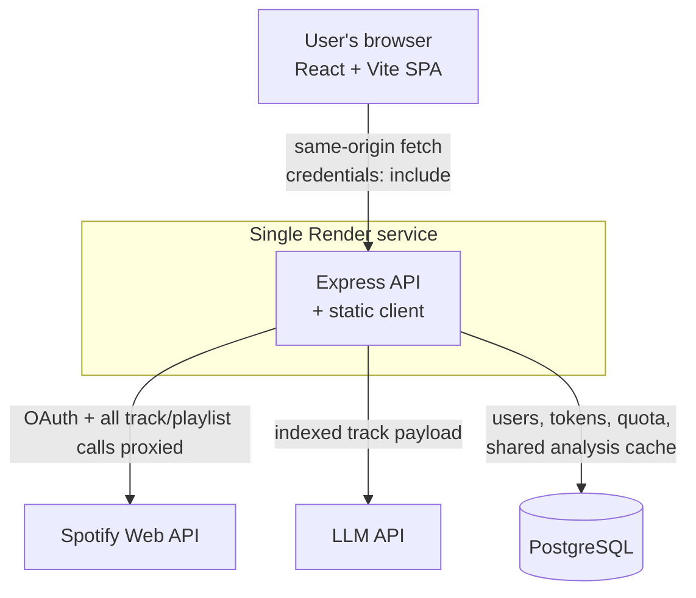

# Playlist Splitter

A full-stack Spotify app that takes an existing playlist and organizes its tracks into smaller mood- and context-based playlists, which you can review track by track and save back to your Spotify account.

The grouping is done by an LLM rather than by genre or audio features, so a 400-track catch-all playlist comes back as a handful of named groups like "Late Night Drive Home" or "Cookout Sunday" instead of "Hip Hop" and "Indie Rock" — categories Spotify already gives you.

<!-- Live demo: add the production URL here as
**Live demo:** https://...
-->

<!-- Screenshot: see docs/screenshots/README.md for what to capture.

-->

## What it does

You log in with Spotify, pick a playlist from your library (or paste any playlist URL), and the app analyzes the tracks and proposes 4–8 named groupings, each with a one-line description. Nothing is written to your account until you ask for it: you can steer the analysis with a text prompt, re-run it, drop groupings you don't want, and uncheck individual tracks before creating a playlist.

<!-- Screenshots: see docs/screenshots/README.md for what to capture.
| Generated groupings | Track-level review |
|---|---|
|  |  |
-->

## Features

- **Spotify OAuth login** — authorization code flow; tokens are held server-side and never sent to the browser.
- **Playlist loading** — browse your full library with pagination, or paste a Spotify playlist URL.
- **Playlist analysis** — tracks are enriched with artist genres, then grouped into 4–8 named, described groupings.
- **Steering and refresh** — pass a free-text instruction ("late-night only", "focus on activities") to reshape the results, or force a fresh analysis.
- **Track-level selection** — expand any grouping, toggle individual tracks, select/deselect all, dismiss groupings.
- **Save back to Spotify** — creates a real playlist in your account containing exactly the tracks you selected.
- **Playlist cleanup** — for the "barely played" and "frequently skipped" groupings, remove those tracks from the source playlist instead of creating a new one.
- **Optional listening-history analysis** — upload the `StreamingHistory` JSON files from a Spotify data export and the app derives usage-based groupings (barely played, old favorites, frequently skipped, core favorites) with tunable thresholds, plus a summary of how much of the playlist you actually listen to. Parsed entirely in the browser; the history is never uploaded.

## Tech stack

| Layer | Stack |
|---|---|
| Frontend | React 19, Vite 7, hand-written CSS (no UI framework) |
| Backend | Node.js, Express 5 |
| Database | PostgreSQL (Neon), Drizzle ORM, drizzle-kit migrations |
| Authentication | Spotify OAuth 2.0 authorization code flow, `cookie-session` |
| Analysis | Anthropic Claude (`claude-sonnet-4-6`) via `@anthropic-ai/sdk`, using structured JSON-schema output and prompt caching |
| Testing | Vitest 4, Supertest, React Testing Library, jsdom, V8 coverage |
| Deployment | Single Render web service serving both the API and the built client |
| Offline ML | Python, scikit-learn, NumPy (see [ML exploration](#from-ml-clustering-to-contextual-grouping)) |

## Architecture



**Authentication flow.** `/auth/login` redirects to Spotify with a CSRF state value stored in the session. On callback, the server verifies the state, exchanges the code for tokens, upserts a user row keyed on the Spotify account ID, and stores the tokens in Postgres. The session cookie holds only that user's UUID — no tokens. Every authenticated request loads the user, refreshes the access token if it is within five minutes of expiry (persisting a rotated refresh token when Spotify issues one), and proxies the Spotify call server-side.

## Engineering highlights

### Index-based model output contract

The natural implementation — send Spotify track IDs to the model and have it return IDs per group — fails, because the model produces plausible-looking IDs that do not exist. Instead, the prompt payload contains no Spotify IDs at all. Each track is sent with an ordinal index and only descriptive fields (title, artist, year, genres, tags), and the model is required to answer with `track_indices`. Hallucinated identifiers become structurally impossible rather than something to detect after the fact.

### Mapping and validating indices back to trusted IDs

The server maps the returned indices back to real track IDs using the original input array, so every ID in a response is one the server itself supplied. Validation drops non-integer, negative, and out-of-range indices; drops duplicates *across all groupings* rather than only within one, so a track can't land in two playlists; and discards groupings left with fewer than two tracks. A regression test asserts that no ID outside the server-supplied set can appear in the output.

### Content-addressed analysis caching

Analyses are cached under `sha256(sorted track IDs + normalized steer text)`. Sorting makes the key independent of track order, and normalizing the steer text means trivially different phrasings hit the same entry while genuinely different instructions cache separately. Entries are shared across users, so a playlist someone has already analyzed is free for the next person. Concurrent writes to the same key resolve with `ON CONFLICT DO NOTHING`.

### Quota and rate limiting

Analysis is the only expensive operation, so it sits behind three gates. Cache hits are free and never counted. Fresh analyses draw against a per-user monthly quota whose window resets lazily on first use after it expires, which avoids needing a scheduled job. A 30-second minimum gap between fresh analyses per user limits bursts, returning `429` with `Retry-After`. Both gates are checked before the model is called, and the counter is incremented only after a successful response — failures never consume quota. Quota state is returned on every response, including rejections, so the UI can display it without an extra request.

### Server-side token storage and refresh

Spotify access and refresh tokens are never exposed to the browser. They live in a Postgres row alongside the token issue time and lifetime; the session cookie carries only an opaque user UUID. Middleware pre-emptively refreshes tokens five minutes before expiry so requests don't fail mid-flight, and correctly persists a new refresh token on the occasions Spotify rotates one. Tests assert that no token value appears in any client-facing response.

### Spotify API edge cases

Spotify returns market-specific track objects whose IDs differ from the ones stored in a playlist, so writes and removals use `linked_from.id` where present along with `market=from_token` — otherwise playlist edits silently target the wrong tracks. Library and track fetches follow cursor pagination to completion, artist-genre resolution is batched to Spotify's 50-ID limit with per-track deduplication, unavailable and local-file tracks are filtered rather than allowed to crash the mapper, and the deprecated `/audio-features` endpoint degrades gracefully when it returns 403.

### Same-origin production deployment

The app originally ran as a static client on one host with the API on another, and sessions silently failed in production: the proxy layer in front of the client stripped `Set-Cookie` from proxied responses, so the cookie set during the OAuth callback never reached the browser. Rather than working around it with cross-site cookie settings, the deployment collapsed to a single service that serves both the built client and the API from one origin. The SPA fallback deliberately excludes `/api/` and `/auth/`, so unknown API paths still return 404 instead of an HTML page. In production the server also enables `trust proxy`, secure and `httpOnly` cookies, `SameSite=Lax` (required for the OAuth redirect, which is a top-level cross-site navigation), an origin allow-list for CORS, and a `/api/health` endpoint for deploy probes.

### Testing

Business logic is deliberately kept out of the route handlers — cache keying, prompt payload shaping, index mapping, quota arithmetic, and token expiry live in small dependency-free modules — which is what makes the interesting logic testable without HTTP, a database, or a network. See [TESTING.md](TESTING.md) for the full breakdown, including the selection-state bug the client tests uncovered.

## From ML clustering to contextual grouping

Before the LLM approach, this project tried to solve grouping with unsupervised learning. That pipeline is complete and reproducible under [`ml_pipeline/`](ml_pipeline/), and it is **not** what runs in production today — the code path is behind a disabled feature flag (`SHOW_ML_CLUSTERS = false`).

**The offline pipeline.** Raw playlist exports are normalized into a schema-validated song record and deduplicated on a priority chain of ISRC → MusicBrainz recording ID → Spotify ID → normalized title and artist, producing a corpus of **14,171 tracks**. Records are enriched with MusicBrainz tags and AcousticBrainz features, then featurized into **819 dimensions** from a 500-term tag vocabulary, a 300-term genre vocabulary, and acoustic classifier outputs, with document-frequency thresholds and filters that strip junk tags such as chart names. Feature blocks are weighted independently before and after scaling. Training applies `StandardScaler`, reduces to **32 dimensions with PCA**, and fits K-Means with **k swept from 4 to 10** and selected by silhouette score. The best corpus-level configuration was **k = 8 at silhouette 0.5563**. Twelve generations of feature and representation artifacts are versioned with per-run training reports.

**Browser-side inference.** A separate path reimplements the Python featurizer in JavaScript (`client/src/ml/kmeansInfer.js`) with exact parity on tokenization, alias mapping, filtering, and imputation, so inference can run client-side with no server cost. Worth being precise about what this does: the exported model artifact contains the scaler and PCA basis but **no centroids and no fixed k**. It embeds a playlist's tracks into the learned 32-dimensional space and then fits K-Means over *that playlist alone*, with a recursive split for oversized clusters. The corpus-level k = 8 result above is a model-selection finding about the corpus, not a set of categories served at runtime.

**Why it isn't the production path.** The pipeline worked technically — the silhouette scores are reasonable and the clusters are coherent. The problem was a product one: clustering over tag, genre, and acoustic metadata reliably recovers **genre**, because that is the dominant signal in the features. The resulting groups looked like "indie rock", "boom bap", "hyperpop" — which is precisely what Spotify already surfaces, and precisely what this app was built to avoid. Substantial effort went into a hand-tuned routing layer mapping clusters onto friendlier display names, which was a strong signal that the representation wasn't producing the axis the product needed. Mood and context are not reliably recoverable from genre metadata, but they are exactly what a language model can infer from titles, artists, and cultural context. The clustering code, artifacts, and evaluation numbers are kept rather than deleted so the comparison stays documented and the path stays reversible.

## Testing

174 automated tests, all passing.

| Suite | Tests | Stack |
|---|---|---|
| Server | 138 | Vitest + Supertest |
| Client | 36 | Vitest + React Testing Library + jsdom |

No test contacts an external service. `fetch` is replaced per-test for Spotify; the LLM SDK and the Postgres client are intercepted at `require()` time, which lets the CommonJS server source be tested unmodified from ESM test files. Authenticated endpoint tests mint their own valid session cookies by reimplementing the signing scheme `cookie-session` uses.

```bash
npm test              # both suites
npm run test:server
npm run test:client
npm run test:coverage
```

Full details, including what is deliberately not covered and why, are in [TESTING.md](TESTING.md).

## Running locally

**Prerequisites:** Node.js 20.19+ or 22.12+, a PostgreSQL database, and a Spotify app from the [developer dashboard](https://developer.spotify.com/dashboard) with `http://127.0.0.1:4000/auth/callback` registered as a redirect URI.

```bash
git clone https://github.com/johnivanov04/spotify-playlist-splitter.git
cd spotify-playlist-splitter

# Server
cd server
npm install
cp .env.example .env      # fill in your own values
npm run db:migrate        # apply schema migrations
npm run dev               # http://127.0.0.1:4000

# Client (in a second terminal)
cd client
npm install
npm run dev               # http://127.0.0.1:5173
```

Server environment variables are documented in [`server/.env.example`](server/.env.example). The required ones are `SPOTIFY_CLIENT_ID`, `SPOTIFY_CLIENT_SECRET`, `SPOTIFY_REDIRECT_URI`, `FRONTEND_URL`, `SESSION_SECRET`, and `DATABASE_URL`; `ANTHROPIC_API_KEY` is needed for playlist analysis, and without it that endpoint returns 503 while the rest of the app continues to work.

The client needs no configuration locally — it defaults to `http://127.0.0.1:4000`. In production, `VITE_API_BASE_URL` points it at the deployed server (see [`client/.env.example`](client/.env.example)).

**Deployment.** In production the server runs with `NODE_ENV=production`, which enables `trust proxy`, secure cookies, request logging, and serving the built client from `client/dist` on the same origin. Deploy targets should build the client (`npm run build` in `client/`) and use `/api/health` as the health check path.

## Project structure

```
client/          React SPA (App.jsx holds the UI and playlist logic)
  src/ml/        Browser-side featurizer + per-playlist K-Means (feature-flagged off)
  tests/
server/
  index.js       Express app: OAuth, Spotify proxy routes, analysis endpoint
  lib/           Pure logic: cache keys, index mapping, quota, token expiry
  db/            Drizzle schema and migrations
  tests/
ml_pipeline/     Offline Python pipeline: corpus, featurization, training
ml_legacy/       The original clustering prototype, kept for reference
```

## Status and limitations

- The Spotify app runs in **Development Mode**, which restricts it to manually allow-listed accounts. Lifting that requires Spotify's Extended Quota Mode, whose approval threshold is far above what a personal project reaches — so the user cap is a platform policy limit, not a technical one.
- The **ML clustering path is feature-flagged off**, for the product reasons described above.
- A **paid tier exists in the schema and quota logic but has no payment integration**; every account is on the free tier.
- The **MusicBrainz/AcousticBrainz enrichment endpoint is implemented but dormant**; AcousticBrainz is no longer serving data.
- `client/src/App.jsx` is a single large component. Splitting it up is the most obvious improvement to the codebase.
